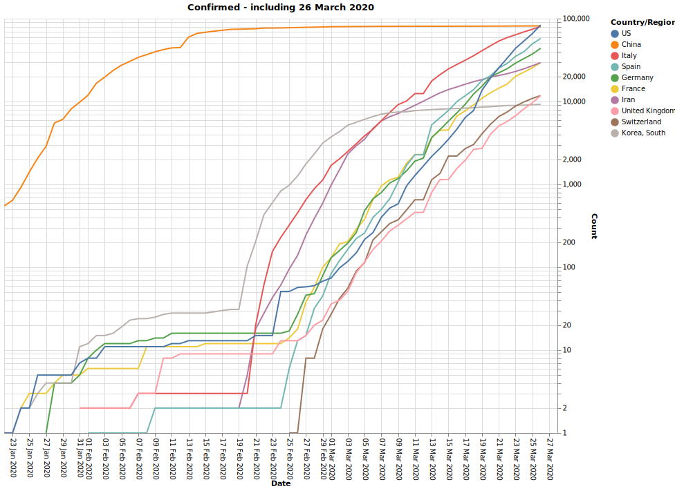
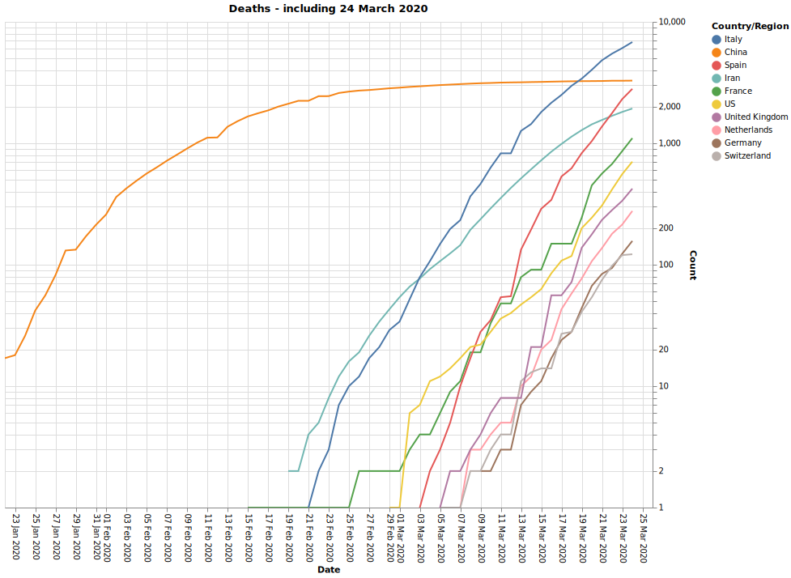
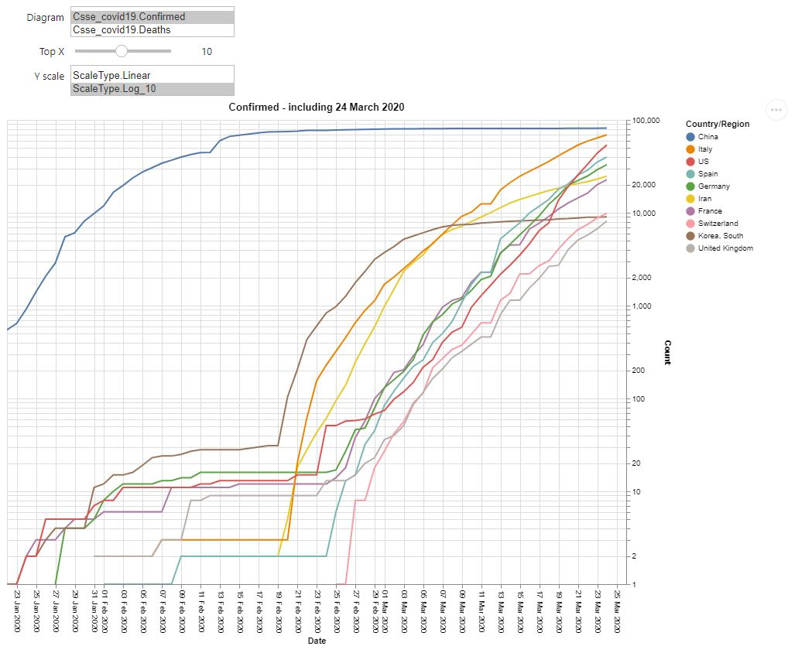

# Covid-19-EDA
Covid-19 EDA, plots tell more than just numbers.

Using the John Hopkins CSSE COVID-19 data: https://github.com/CSSEGISandData/COVID-19 <br>

## Top 10 - absolute numbers
The top 10 affected countries regarding absolute numbers of confirmed Covid-19 infections and deaths due to Covid-19 infections.



---
# Installation of the requirements using Miniconda
1. Install Miniconda with Python 3.7 or later [https://docs.conda.io/en/latest/miniconda.html](https://docs.conda.io/en/latest/miniconda.html)
2. OS dependent
    * Linux &rarr; Open a terminal window
    * Windows &rarr; Open the Ananconda Prompt
4. Create a virtual environment and activate the virtual environment
    ```bash
    conda create -n csse_covid19_eda python=3.7
    conda activate csse_covid19_eda
    ```
5. Install the required libraries using the [requirements.txt](requirements.txt) file
    ```bash
    pip install -r requirements
    ```
6. Start Jupyter-Lab
    ```bash
    jupyter-lab
    ```
    A browser will open running Jupyter-Lab
7. Open the Jupyter notebook [CSSE_Covid_19_time_series.ipynb](CSSE_Covid_19_time_series.ipynb) and run all cells.

The first plot can be manipulated using interactive controls
* Diagram type
    * Confirmed cases
    * Deaths
* Top X
    * Plotting the reported cases of the X (here: 10) countries with the highest absolute case numbers
* Y scale
    * Linear
    * Logatrithmic using base 10



